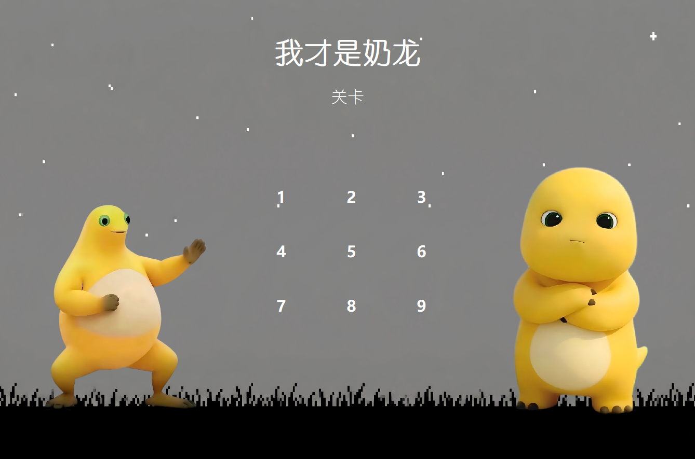

# 我才是奶龙！

## 简介
“我是奶龙！” “我才是奶龙！！！”

不好，两只奶龙混在一起了？？

什么？？他们还会互相模仿！！

天呐，快来帮帮奶龙！

## 玩法
冒牌的奶龙会模仿奶龙的全部动作！

现在，你能够控制所有的奶龙一起移动，但素你要消灭冒牌的奶龙，保护好真的奶龙，才能通关噢！ 

## 操作方式
- 左/右方向键：向左或向右移动
- 上方向键：跳跃

## 关卡说明
游戏目前共设计了 9 个关卡，整体难度逐步提升。

- 第1关：基础教学关，帮助理解“真奶龙生存、假奶龙死亡”的核心规则。

不管了，你玩了就知道了。。。

怎么直接玩呢？：下载zip->dist->I_am_nailong.exe
